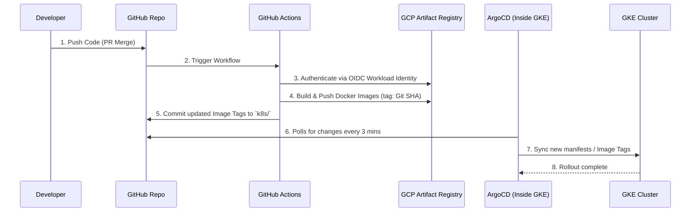

# GitOps Enterprise Workflow

As part of the **v7.4.0 Absolute GitOps Evolution**, Inso.Code employs a GitOps continuous delivery paradigm using **ArgoCD** and **GCP Workload Identity Federation**.

## The Security Paradigm
1. **No Static Keys**: We do not store Google Cloud Service Account JSON keys in GitHub Secrets.
2. **OIDC Federation**: GitHub Actions generates an ephemeral OpenID Connect (OIDC) token. GCP verifies the token's cryptographic signature against GitHub's JWKS endpoint.
3. **Least Privilege**: The CI/CD Service Account is only granted `roles/artifactregistry.writer`. It cannot provision infra or read production databases.

## The Deployment Pipeline



## Setup Instructions

### 1. Install ArgoCD
Connect to the GKE Autopilot cluster and run:
```bash
kubectl create namespace argocd
kubectl apply -n argocd -f https://raw.githubusercontent.com/argoproj/argo-cd/stable/manifests/install.yaml
```

### 2. Apply the Root Application
The root application (`k8s/argocd/application.yaml`) implements the App of Apps pattern. Apply it to tell ArgoCD to watch the `k8s/` directory in our repo.
```bash
kubectl apply -f k8s/argocd/application.yaml
```

### 3. CI/CD Operations
There is no longer a need to run `kubectl apply` manually. To deploy an update, simply push the code. GitHub Actions will package the artifact and update the manifests, which ArgoCD will faithfully synchronize to production without human intervention.
