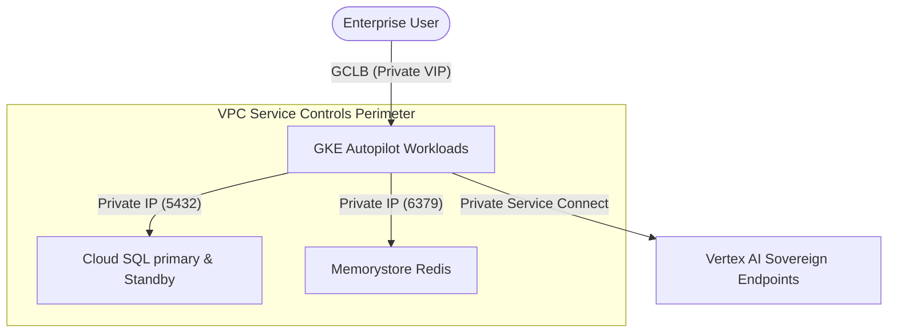

# Google Cloud VPC Service Controls (VPC-SC) & Private Endpoints

For defense, government, and sovereign enterprise tenants, Inso.Code enforces a perimeter security boundary inside Google Cloud using **VPC Service Controls (VPC-SC)** and **Private Endpoints (Private Service Connect)**.

This prevents data exfiltration and restricts network traffic to explicitly authorized paths.

---

## 1. Network Boundary Architecture

All core application services (GKE cluster, Redis Memorystore, and Cloud SQL Postgres) operate inside a private VPC network (`alti-vpc-prod`) with no direct public internet exposure.



### Key Network Controls
1. **No External IPs**: Pods and database instances do not possess public IPv4 addresses. External traffic is terminated at the Global HTTPS Load Balancer (GCLB) using Google Cloud Armor for WAF protection.
2. **Private Service Connect (PSC)**: API traffic to Google Cloud services (such as Vertex AI and Cloud KMS) is routed through private IP endpoints mapping to Google's internal network backbone.

---

## 2. DNS Zone Settings (Private Google Access)

To ensure that Vertex AI api requests (`us-central1-aiplatform.googleapis.com`) do not resolve to public IP space, we establish private DNS zones in Cloud DNS targeting restricted Google VIPs:

```text
restricted.googleapis.com  -->  199.36.153.4/30 (IP ranges)
```

### Cloud DNS Config (Terraform Declared)
```hcl
resource "google_dns_managed_zone" "private_googleapis" {
  name        = "private-googleapis"
  dns_name    = "googleapis.com."
  description = "Private routing for Google API endpoints"
  visibility  = "private"

  private_visibility_config {
    networks {
      network_url = google_compute_network.alti_vpc.id
    }
  }
}

resource "google_dns_record_set" "cname_googleapis" {
  name         = "*.googleapis.com."
  managed_zone = google_dns_managed_zone.private_googleapis.name
  type         = "CNAME"
  ttl          = 300
  rrdatas      = ["restricted.googleapis.com."]
}
```

---

## 3. VPC-SC Service Perimeter

A strict Service Perimeter is enforced around all resources in the GCP project:

```hcl
resource "google_access_context_manager_service_perimeter" "enterprise_perimeter" {
  parent = "accessPolicies/1234567890"
  name   = "accessPolicies/1234567890/servicePerimeters/enterprise_boundary"
  title  = "Enterprise Sovereign Boundary"
  status {
    restricted_services = [
      "aiplatform.googleapis.com",
      "cloudkms.googleapis.com",
      "sqladmin.googleapis.com",
      "storage.googleapis.com"
    ]
    
    access_levels = [
      google_access_context_manager_access_level.trusted_corporate_ips.name
    ]
  }
}
```

### Ingress & Egress Rules
- **Ingress**: Only traffic originating from trusted corporate network IPs or authenticated Cloud IAP sessions can access GKE API endpoints.
- **Egress**: Workloads inside GKE are blocked from calling any external API endpoints (e.g. AWS, OpenAI, or unapproved third-party servers). Connection attempts trigger immediate security alerts logged to the WAF audit log service.
